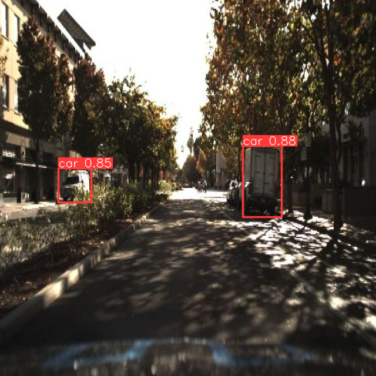

# YOLOv8-Object-Detection

## Overview
This project implements a Python program for car recognition in an image using the YOLOv8 algorithm.

## Prerequisites
The dependent packages for YOLOv8 are as follows:

* Python 3.9.12
* TensorFlow 2.15.0
* ultralytics
* OpenCV 4.6.0
* Sklearn 1.26.3
* SciPy 1.7.3
* skimage 0.19.2
* PIL 9.4.0
* IPython 7.34.0


## Program Installation

To install and use the YOLOv8 algorithm, follow these instructions:

### Download YOLOv8 Source Code from GitHub: 

To use YOLOv8, we need to download the source code from the YOLOv8 GitHub repository. The YOLOv8 source code is publicly available on GitHub. Follow these steps:
   - Step 1: Access the YOLOv8 GitHub repository [here](https://github.com/ultralytics/ultralytics).
  

### Prepare the Data 

To train YOLOv8 on any dataset, you need two main components:
   - Data directory: Prepare a directory that contains the dataset. Building a custom dataset can be a painful process. It might take dozens or even hundreds of hours to collect images, label them, and export them in the proper format. Fortunately, Roboflow makes this process straightforward. If you only have images, you can label them in Roboflow. For details please refer [here](https://fulldataalchemist.medium.com/building-your-own-real-time-object-detection-app-roboflow-yolov8-and-streamlit-part-1-f577cf0aa6e5).
  


### Perform Training
 After completing the preparation steps, you can start the training process with the prepared dataset. Execute the following command (replace the data.yaml file name if using a different dataset):

   ```python model.train(data='/content/car-detection-2/data.yaml', epochs=20, imgsz=640)
   ```
### Test the model

   To use the trained model on any arbitrary image with path "source" , use the following command:

   ```python
 results=model.predict(source="",
              save=True, conf=0.2,iou=0.5)
   ```

fter finishing the training, you can test your model with the following command:


   ```python
   results=model.predict(source="Your test image path",
              save=True, conf=0.2,iou=0.5)
result = results[0]
print(result)
box = result.boxes[0]
print(box)
for result in results:
    boxes = result.boxes  # Boxes object for bbox outputs
    masks = result.masks  # Masks object for segmentation masks outputs
    probs = result.probs
cords = box.xyxy[0].tolist()
class_id = box.cls[0].item()
conf = box.conf[0].item()
print("Object type:", class_id)
print("Coordinates:", cords)
print("Probability:", conf)
for box in result.boxes:
    class_id = result.names[box.cls[0].item()]
    cords = box.xyxy[0].tolist()
    cords = [round(x) for x in cords]
    conf = round(box.conf[0].item(), 2)
    print("Object type:", class_id)
    print("Coordinates:", cords)
    print("Probability:", conf)
    print("---")
    plot = results[0].plot()
plot = cv.cvtColor(plot, cv.COLOR_BGR2RGB)
display(Image.fromarray(plot))
 ```


In my case we get result af follows:



Feel free to modify the content based on your specific project requirements and information.